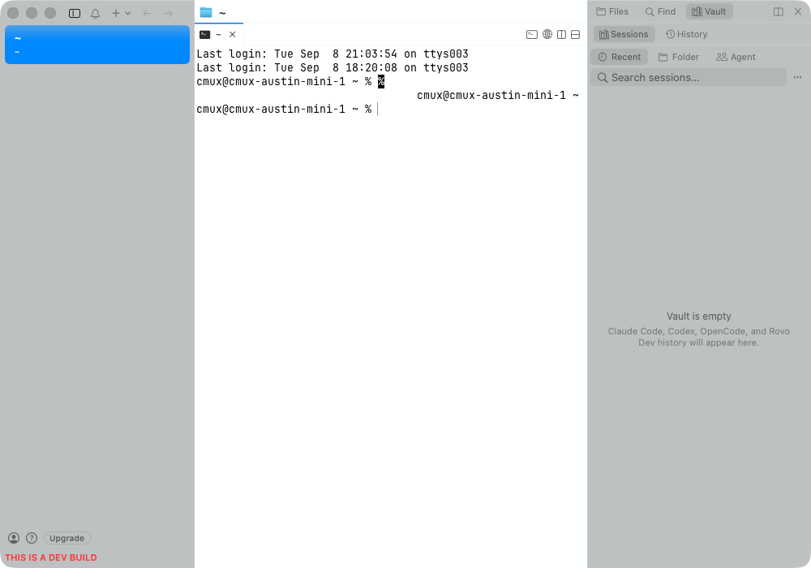
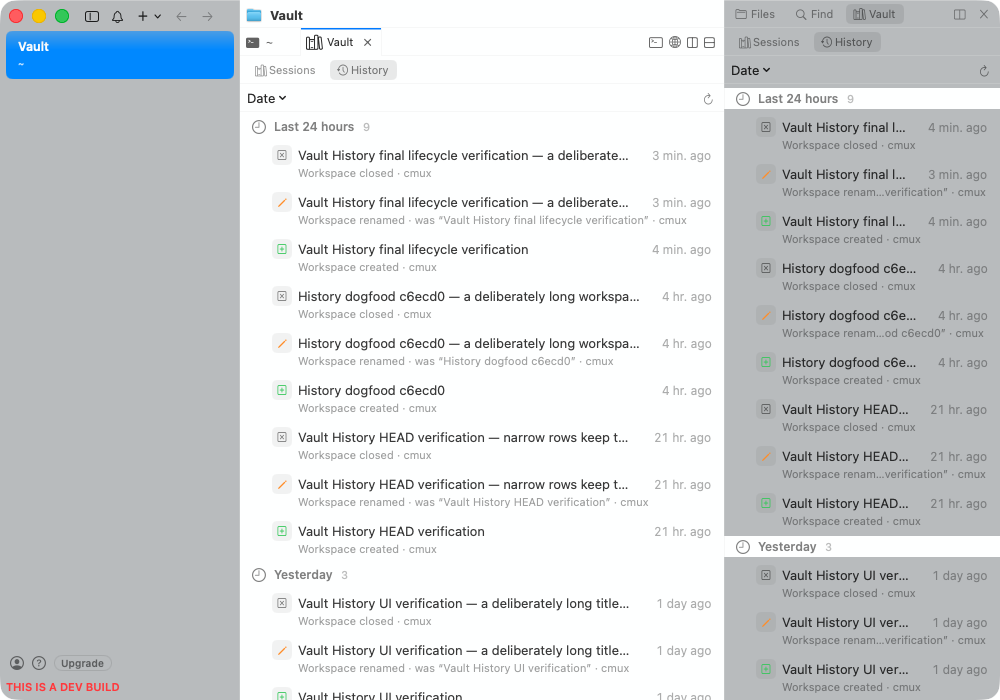

# Vault History — revision-labeled evidence

Feature PR: https://github.com/manaflow-ai/cmux/pull/9131

Current feature source: `1198ba65bfe2670bc62919177c7715971a1f60a4`, including main `8369461dd6`. This evidence is not merge approval. The PR touches iOS/mobile code and remains for Austin to merge after its remaining gates pass.

## Actual CUA visual reference: existing Sessions → added History

These screenshots were personally inspected during this continuation and were captured by CUA on the leased macOS 26.4 Mac at **99174ef23aba144096b9d8a2b7de37bd1460675b**. They are not screenshots of the newer quit-drain fix at 1198. The Vault presentation sources are unchanged across those revisions, but the lifecycle owner is changed and still needs final live verification.

The "before" image is the existing Sessions tab/style reference, not an invented pre-fix screenshot. The "after" image shows the added History tab, its compact row treatment, truncation, trailing times, and simultaneous sidebar/pane rendering after a real normal quit/relaunch.

Both mounts exercised all five grouping choices. A new owned workspace was created, renamed with a deliberately long title, and closed. Exactly three expected events were added to the previous nine; all **12** persisted events survived normal quit/relaunch byte-for-byte, SHA-256 `a796c687f106e1647246bfbc69900aae5b3b03ae9f24c45135e41115128e1e03`. The 991 app was then normally quit.

## Executed regression evidence

- [Test-only e514 run 34317347872](https://github.com/manaflow-ai/cmux/actions/runs/34317347872): 25 tests, six intended assertions fail across the launching/restoring quit cases. The retained launch event is lost before the fix.
- [Exact 1198 focused run 34319696306](https://github.com/manaflow-ai/cmux/actions/runs/34319696306): **25 History-owner + 1 launch-transaction + 3 OpenCode tests pass**. This proves the fixed path and the corrected singular-test execution guard; assertions and zero-test detection are retained.
- [Exact 1198 UI run 34319822470](https://github.com/manaflow-ai/cmux/actions/runs/34319822470): first attempt fails during application activation (Running Background) at `RightSidebarChromeHeightUITests.swift:20`, before Vault interaction. It is not a successful UI run. A same-HEAD retry was requested.
- Eight `MobileTerminalLaneCoordinatorTests` pass at exact 1198 on the leased Mac, from a `git archive` of the commit into a lease-isolated source directory. Both main's failing-provider integration test and this branch's missing-provider policy test execute. See [remote test log](mobile-lane-1198ba65bf.log). This is not physical-iPhone verification.

Selected History red/green log lines are retained in [quit-regression-counts.txt](quit-regression-counts.txt); complete hosted logs remain linked above and are retained locally in compressed form. Zero-test, compilation-failure, and cancelled attempts are not counted as passing or behavioral-red proof.

## Remaining gates at publication

Required [CI 34320269336](https://github.com/manaflow-ai/cmux/actions/runs/34320269336) is red because its determinism scan flags two immediate injected callbacks in unchanged `CmxRetryAfterPolicyTests.swift:70,77`, preventing full macOS shards from running. Its web check passes. A separate six-test Vault transfer suite at 1c254 fails browser mouse-up drop-target routing; equality of those files to main is not clean-main runtime proof. The exact-HEAD tagged cloud app is queued behind the shared build lock, so final live behavior is unverified.

The optional backend is disabled for local-History dogfood. Real VM provisioning, locked-Keychain behavior, and physical iPhone flows are not exercised. No local compilation or XCUITest, broad TCC edits, test assertion removal, or new blanket determinism allowlist was used. The unrelated Bonsplit working-tree change remains untouched. These limitations are also disclosed in the PR.
