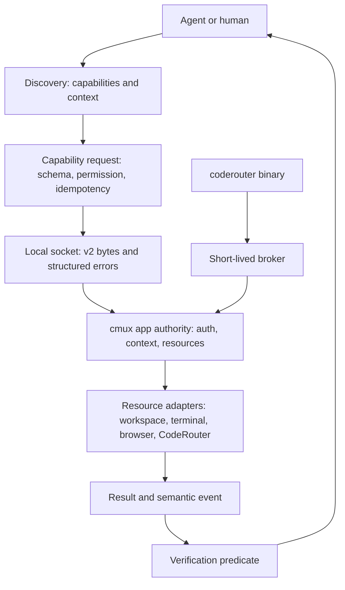

# Agent-first CLI and CodeRouter system plan

Status: migration in progress. The living completion record is
[`docs/cli-rust-migration-status.md`](cli-rust-migration-status.md). The Rust compatibility crate is
`cmux-tui/crates/cmux-cli`. It builds two entry points from one codebase:
`cmux` and `coderouter`.

During the migration installer these are copied as `cmux-rust` and
`coderouter-rust`. This is deliberate. It gives release and end-to-end tests a
real artifact without replacing the production Swift CLI before the parity
gate passes. The macOS app target builds and signs these candidate artifacts;
release stripping includes both binaries in the size measurement.

This plan defines the system contract for moving the macOS CLI from Swift to
Rust. It is written around end-user behavior and agent control. A literal
source-line translation is not a useful correctness test because Swift and
Rust have different runtimes, libraries, and process models. The exact target
is observable parity: argv parsing, output, exit status, socket bytes, files,
environment, authentication, side effects, and error shape.

## System outcome

An agent should need one discoverable control surface:

```text
cmux capabilities --json
  -> app-authoritative capability ids, schemas, permissions, context, lifecycle, errors
cmux capability.invoke <id> --json <input>
  -> one structured result, operation id, and verification hints
```

The human aliases remain short:

```text
cmux cr add codex
coderouter add codex
cmux coderouter claude list --json
```

`cmux` and `coderouter` use the same Rust protocol library. The separate
`coderouter` executable is a supported release artifact. The CodeRouter
engine remains a separately verified upstream executable until its source is
available as a stable embeddable Rust crate. The wrapper and the native cmux
capabilities do not create a second login or a second persistent credential
store.

## Control-plane tower

The system is easiest for an agent to reason about when each layer has one
authority and one observable contract:



The Rust CLI owns discovery, framing, validation, and process boundaries. The
app owns credentials and mutable resource state. The server owns capability
truth. Events and verification close the loop so an agent can tell whether a
request changed durable state instead of trusting a successful write alone.

## System invariants and expert review gates

These invariants connect the app, socket, CLI, CodeRouter process, and release
artifact into one control plane:

| Invariant | Expert rejection of the tempting shortcut | Required evidence |
| --- | --- | --- |
| The running app owns capabilities and credentials | A static CLI registry or a second login can drift from server state and split identity | `system.capabilities` response, one `aiAccounts.upload` request with no token fields, and auth-source reporting |
| A broker is valid only inside the app's temporary directory and lifetime | Checking only a filename allows a path from another directory or a stale response to become an auth boundary | Parent-directory check, required config file, cleanup result, and fail-closed malformed-response test |
| Swift remains the observable oracle until every source dispatch label is covered | A cheaper line-by-line rewrite can compile while changing aliases, output, errors, or side effects | Source hash inventory, normalized dual-run transcript, and family status at `complete` |
| The small CLI stays separate from the TUI dependency graph | Reusing the large Rust binary is easy but makes the bundle and startup cost depend on PTY, browser, and remote code | Per-slice Mach-O sizes and dependency audit |

Every migration decision must record the expert objection, the evidence that
answers it, and the remaining limitation. A convenience shortcut without that
record is not a cutover candidate.

## Core primitives

### Capability

The primitive is a typed capability, not a screen or a subcommand. Every
capability has:

- a stable id, for example `coderouter.account.add`;
- input schema, including allowed context sources;
- output schema and human rendering;
- lifecycle (`instant`, `stream`, `detached`, or `event`);
- permission requirements (`socket.control`, `account.write`, `network`);
- idempotency behavior and a retry rule;
- verification commands or event predicates.

The CLI, socket, UI command palette, hooks, and agents all invoke the same
capability. The old command names are aliases that compile into capability
requests.

### Context

Context is explicit and inspectable. It may contain the caller workspace,
surface, socket, git repository, branch, selected text, agent session, team,
and authentication state. Context is never inferred from the focused window
when a caller supplied an id or socket.

An agent can request a context snapshot before mutation:

```text
cmux context --json
```

`capabilities --json` asks the running app for `system.capabilities`, which
keeps the server registry authoritative. `capabilities --offline` exposes only
the Rust migration catalog and marks those entries experimental. An agent must
not treat the offline catalog as proof that a command is production-ready.

### Operation

Every mutation returns an operation id, status, and a verification hint. The
server may later emit `operation.completed` or `operation.failed` with the same
id. A retry uses the same idempotency key and does not duplicate an account,
workspace, or remote process.

### Event

Events are small semantic facts. The first set is:

```text
agent.session.started
agent.turn.started
agent.turn.completed
agent.approval.requested
agent.question.requested
agent.plan_review.requested
agent.error.reported
agent.state.changed
operation.completed
operation.failed
workspace.created
coderouter.account.changed
```

`agent.blocked` is derived from unresolved approval, question, or plan-review
events. It is not the source of truth.

## Authentication and CodeRouter

There is one cmux session authority. `cmux cr add codex` sends only the
provider and optional label through the local socket as
`aiAccounts.upload`. The app reads `~/.codex/auth.json`, refreshes its existing
session, and uploads the credential. The CLI does not print, persist, or place
OAuth tokens in argv, logs, or a long-lived environment variable.

The advanced CodeRouter CLI receives a short-lived broker configuration from
the cmux app whenever a live cmux socket is available. The configuration is
removed after the child exits. The broker contains the same Stack token pair
and team selection already held by cmux. `coderouter logout` therefore reports
that the cmux session owns sign-out. When cmux is not installed or not running,
the standalone binary can use the upstream CLI's own mode; a malformed broker
response fails closed instead of silently switching auth authorities.

The broker is a process boundary, not an authentication boundary. The local
socket remains same-user trusted and keeps its password/keychain policy. The
Rust client matches the explicit password, `CMUX_SOCKET_PASSWORD`, and shared
password-file order. macOS keychain fallback is still a parity item; the Rust
candidate reports only the source it can prove (`argument`, `environment`, or
`file`) and never exposes the password value.

## Rust module boundary

```text
cmux-cli-core
  argv and capability parser
  legacy v2 socket framing and typed errors
  context and output contracts
  CodeRouter adapter and child-process launcher

cmux (bin)
  top-level cmux aliases and compatibility routing

coderouter (bin)
  standalone CodeRouter entry point using the same adapter

cmux app
  auth coordinator, credential files, backend clients, socket worker

cmux-tui / cmux-remote
  remote terminal and machine protocol; never becomes a dependency of the
  local CLI merely because both projects are Rust
```

The local CLI must stay independent of the full TUI dependency graph. Linking
the TUI crate into the CLI would make a small control client inherit terminal,
PTY, browser, and remote transport code. Shared protocol types may move to a
small crate, but UI and daemon dependencies do not.

## Migration and conformance

1. **Inventory.** Generate the source-derived dispatch inventory with
   `scripts/generate-cli-rust-command-inventory.py`. It currently records 126
   Swift dispatch arms and 156 command labels, with a SHA-256 fingerprint of
   the source region. Join every label to help text, socket method, side
   effects, and tests. Mark every command as `native`, `delegated`,
   `local-file`, or `pending`.
2. **Transport.** Match v2 request shape, newline framing, auth handshake,
   response timeouts, multiline responses, structured errors, marker-file
   socket discovery, and socket selection. Test with a deterministic
   Unix-socket fixture.
3. **Low-risk commands.** Port version, help, ping, capabilities, rpc, and
   CodeRouter account commands. Compare Swift and Rust stdout, stderr, exit
   code, request method, and params.
4. **Command families.** Port one family at a time. Each family needs a
   behavior fixture and a live socket integration test before routing to Rust.
5. **Dual-run audit.** A test-only mode runs Swift and Rust against the same
   fixture and reports a normalized diff. Secrets are redacted before diffing.
6. **Cutover.** Bundle the Rust universal binary as `cmux-rust`, route the
   installed `cmux` shim to it for complete families, and retain Swift only
   for families whose manifest is still `pending`.
7. **Removal.** Delete Swift CLI sources only after the manifest has no
   `pending` rows and release, hook, remote, and app-launch tests pass.

The current Rust slice proves the transport fixture, native `cr add codex`
request, default socket path, capability/context discovery, and two binary
targets. It is not full parity. The source-derived inventory check fails when
the Swift dispatch changes without regeneration.
The Swift binary remains the production CLI until the manifest and conformance
suite prove complete coverage.

## Agent ergonomics

- `capabilities --json` is the discovery root when cmux is running. It returns
  the app's schemas and permission requirements, not prose-only help.
- `capabilities --offline` is a development fallback. Its entries are
  explicitly marked experimental and cannot authorize a production action.
- `--json` returns one object with `ok`, `operation_id`, `result`, or
  `error:{code,message,details,retryable,action}`.
- Errors use stable codes. Human text may be localized; codes are not.
- Mutations accept `--dry-run` where a preview is safe.
- Mutations accept `--idempotency-key` and expose the key in the result.
- `--explain` returns the resolved socket, context, capability, and permission
  decision before execution. Secrets are always redacted.
- `--verify` runs the capability's verification predicate and returns the
  observed state.
- Agents can subscribe to event streams with a cursor and resume after a
  disconnect. Event payloads contain references and bounded summaries, not
  terminal transcripts or credentials.
- Every command has a no-socket help path. Agents can discover syntax while
  cmux is closed.
- Workspace, pane, surface, and machine handles accept stable ids and human
  refs. The resolved id is returned in JSON.

## Extension points

Third-party integrations add data, not hardcoded branches. An adapter declares
its id, binary detection, hook merge strategy, semantic event mapping, resume
command, transcript source, capabilities, and permissions. A capability
provider can then add a new agent, review system, or runbook without changing
the CLI parser.

The registry must validate adapter manifests before install. A manifest cannot
request arbitrary filesystem, network, or process access without an explicit
permission and trust decision. The initial registry is local and signed; a
marketplace can be added only after the capability contract and verification
model are stable.

## Size and release policy

The current installed universal Swift CLI is about 46.2 MiB. The bundled
CodeRouter executable is about 15.0 MiB universal. A Rust replacement is a
size improvement only if its complete universal artifact, plus the separate
CodeRouter artifact and required metadata, is below the Swift baseline. The
arm64 and x86_64 sizes must be reported separately because static Rust
dependencies can change the split.

The current dependency-light Rust slice measures 1,375,328 bytes universal
for `cmux` and 1,375,408 bytes for `coderouter`, before signing. Earlier
slices measured 1,358,480/1,374,944, 1,358,592/1,358,672,
1,341,568/1,341,648, and 1,306,800/1,306,864 bytes. These are useful signals
that a small Rust CLI can save bundle space, but they are not full parity
measurements. The full command migration must be measured again after each
family is added.

Release CI must record:

- compressed download size;
- installed app size;
- each Mach-O slice size;
- stripped and signed size;
- CodeRouter size and checksum;
- parity manifest coverage;
- output/exit/protocol conformance result.

Rust build scripts keep the repository disk guard active. A local developer
may set `CMUX_ALLOW_LOW_SPACE_BUILD=1` for an explicit test build when the
guard permits it; the installer never sets that override silently.

A lazy download is allowed for advanced CodeRouter features only when the
primary `cr add codex` path works from a fresh cmux download. The release must
fail closed on an unverified CodeRouter checksum.

## Expert trade-offs

| Decision | Why it is coherent | Why an expert could reject it |
| --- | --- | --- |
| Keep Swift as the oracle during migration | It protects behavior while Rust grows | A long dual-stack period increases maintenance; the manifest and cutover gate limit this period |
| Keep CodeRouter as a separate verified executable | Source is not available as a stable crate and release updates stay independent | A second executable adds bytes and a process boundary; a future embeddable crate should replace it only after API, license, and size proof |
| Native `cr add codex` through the cmux socket | It removes a second login and keeps OAuth tokens inside the app auth path | It couples the alias to the app socket; the standalone `coderouter` path remains available for users without cmux |
| Separate small Rust CLI crate instead of linking cmux-tui | It preserves bundle-size control and startup speed | It duplicates some protocol types; move only small stable wire types into a shared crate after measuring dependency growth |
| Capability registry before marketplace | Agents need stable verbs and schemas before listings can compose | It delays marketplace work; adding listings before contracts would compound ambiguity and unsafe permissions |
| Structured errors and verification predicates | Agents can recover and prove state without parsing prose | It requires protocol and server changes; Swift compatibility stays until those fields are implemented |

## Completion gate

The migration is complete only when every Swift command has a manifest row with
passing parity evidence, the Rust universal binary replaces the shipped Swift
resource, `cmux cr add codex` works on a fresh install with one cmux login,
standalone `coderouter` is published and verified, and release size is measured
against the recorded Swift baseline. Until then the goal remains active.
